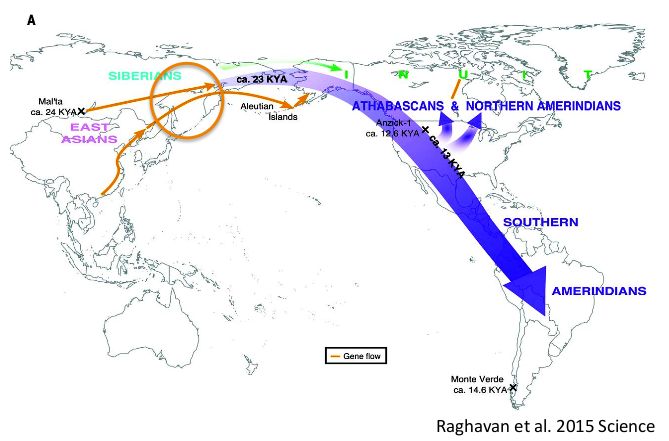
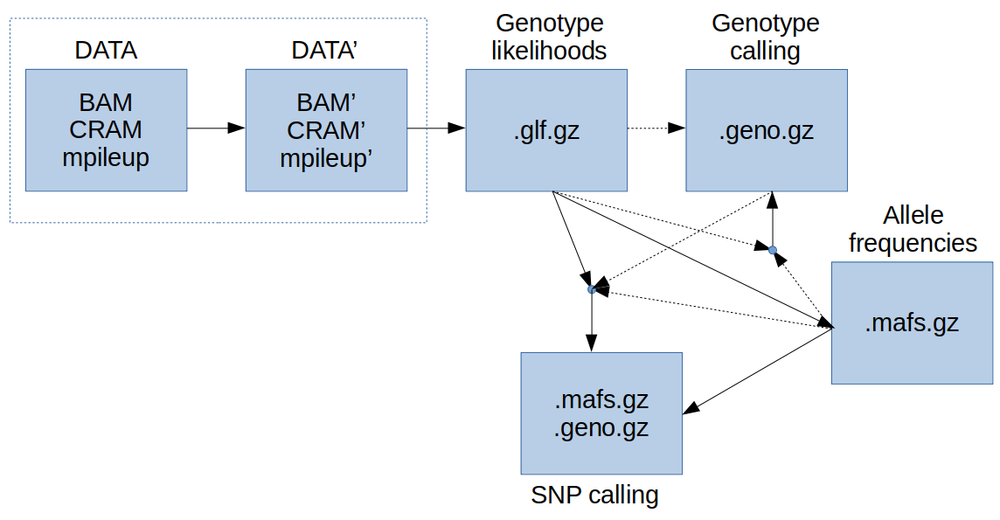
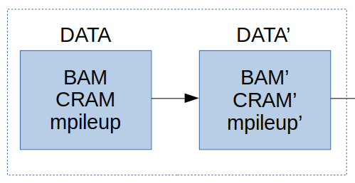
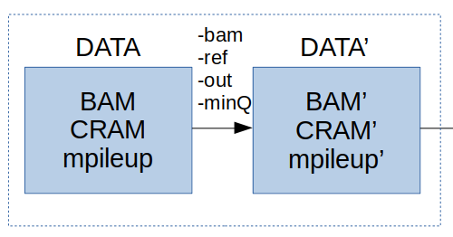
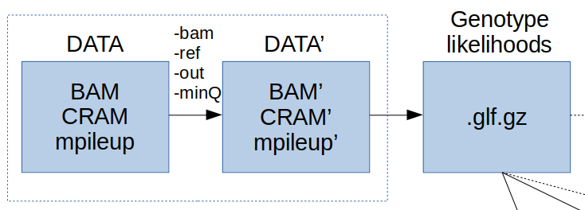
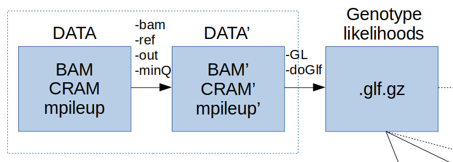
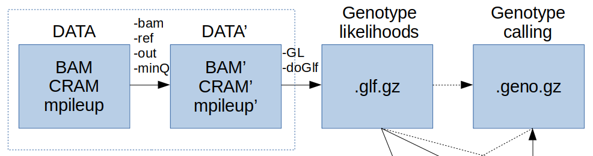
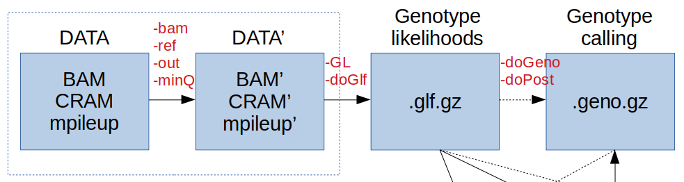
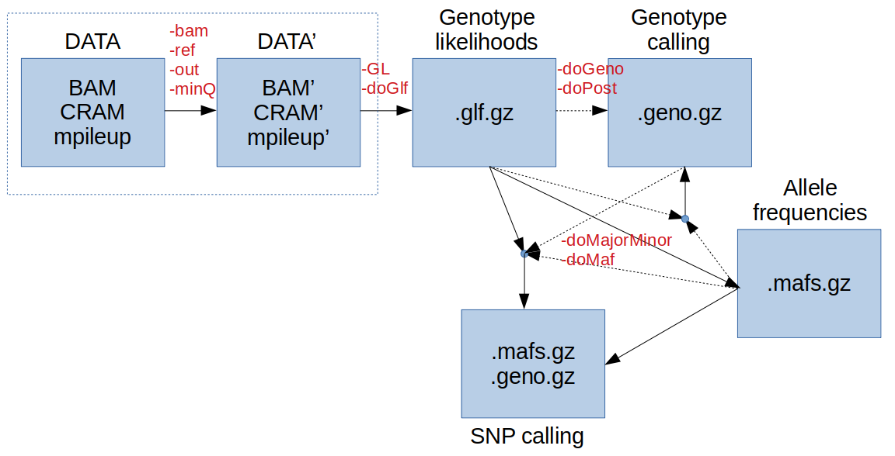

# Exercises in estimating from NGS data

Exercises is a modified version of [Matteo Fumagilli's exercises](https://github.com/mfumagalli/Copenhagen)

In this session you will learn how to do:
* genotype calling
* allele frequency estimation
* variant (or SNP) calling
### Data

As an illustration, we will use 40 BAM files of human samples (of African, European, East Asian, and Native American descent), a reference genome, and putative ancestral sequence. We will also use 10 BAM files of Latinos in one example.


*MOTIVATION*
Detecting signatures of natural selection in the genome has the twofold meaning of (i) understanding which adaptive processes shaped genetic variation and (ii) identifying putative functional variants.
In case of humans, biological pathways enriched with selection signatures include pigmentation, immune-system regulation and metabolic processes.
The latter may be related to human adaptation to different diet regimes, depending on local food availability (e.g. the case of lactase persistence in dairy-practicing populations).

The human Ectodysplasin A receptor gene, or EDAR, is part of the EDA signalling pathway which specifies prenatally the location, size and shape of ectodermal appendages (such as hair follicles, teeth and glands).
EDAR is a textbook example of positive selection in East Asians (Sabeti et al. 2007 Nature) with tested phenotypic effects (using transgenic mice).

Recently, a genome-wide association study found the same functional variant in EDAR associated to several human facial traits (ear shape, chin protusion, ...) in Native American populations (Adhikari et al. Nat Commun 2016).




*HYPOTHESIS*

- Is the functional allele in East Asian at high frequency in other human populations (e.g. Native Americans)?
- Can we identify signatures of natural selection on EDAR in Native Americans?
- Is selection targeting the same functional variant?

*CHALLENGES*
- Admixed population
- Low-depth sequencing data
- Effect of genetif drift
- ...


We are using the program [ANGSD](http://popgen.dk/wiki/index.php/ANGSD) (Analysis of Next Generation Sequencing Data).
More information about its rationale and implemented methods can be found [here](http://www.ncbi.nlm.nih.gov/pubmed/25420514).

According to its website *ANGSD is a software for analyzing next generation sequencing data. The software can handle a number of different input types from mapped reads to imputed genotype probabilities. Most methods take genotype uncertainty into account instead of basing the analysis on called genotypes. This is especially useful for low and medium depth data.*

Please make sure to follow these preparatory instructions below before running these examples. 
Briefly, you need to first login to the server with your user name and password. And once you are logged in you should set the path to the software and various data that will be used by pasting in the following code in the terminal:

```bash

DIR=/course/popgen23/anders/ngsInference
REF=$DIR/data/ref.fa.gz
ANC=$DIR/data/anc.fa.gz

## see paths of used programs
which angsd
```

Also, you will have to create two folders in your working directory, one for your results and one for your intermediate data, which you can do by running the following code:


```bash
mkdir -p ~/NGSexercise
cd ~/NGSexercise
mkdir -p Results
mkdir -p Data
```


--------------------------------------------------

### Workflow

The workflow for this practical looks like this



which seems daunting! 
However, that's actually not the case and we will go through each step to understand each one of them.

The workflow is roughty divided into four steps:

0. Data filtering and I/O
1. Genotype likelihoods
2. Genotype calling
3. SNP calling

---------------------------------------------

#### 0. Data filtering and I/O

First, we will learn **how to build a command line in ANGSD**.



To see a full list of options in ANGSD type the following in the terminal:
```bash
angsd
```

<details>
<summary> click here to see a full list options </summary>

```
Overview of methods:
	-GL		Estimate genotype likelihoods
	-doCounts	Calculate various counts statistics
	-doAsso		Perform association study
	-doMaf		Estimate allele frequencies
	-doError	Estimate the type specific error rates
	-doAncError	Estimate the errorrate based on perfect fastas
	-HWE_pval	Est inbreedning per site or use as filter
	-doGeno		Call genotypes
	-doFasta	Generate a fasta for a BAM file
	-doAbbababa	Perform an ABBA-BABA test
	-sites		Analyse specific sites (can force major/minor)
	-doSaf		Estimate the SFS and/or neutrality tests genotype calling
	-doHetPlas	Estimate hetplasmy by calculating a pooled haploid frequency

	Below are options that can be usefull
	-bam		Options relating to bam reading
	-doMajorMinor	Infer the major/minor using different approaches
	-ref/-anc	Read reference or ancestral genome
	-doSNPstat	Calculate various SNPstat
	-cigstat	Printout CIGAR stat across readlength
	many others

Output files:
	 In general the specific analysis outputs specific files, but we support basic bcf output
	-doBcf		Wrapper around -dopost -domajorminor -dofreq -gl -dovcf docounts
For information of specific options type: 
	./angsd METHODNAME eg 
		./angsd -GL
		./angsd -doMaf
		./angsd -doAsso etc
		./angsd sites for information about indexing -sites files
Examples:
	Estimate MAF for bam files in 'list'
		'./angsd -bam list -GL 2 -doMaf 2 -out RES -doMajorMinor 1'
```
</details>

ANGSD can accept several input files, as described [here](http://popgen.dk/angsd/index.php/Input):

* BAM, CRAM, mpileup
* VCF, GLF, beagle

Here we show how ANGSD can also perform some basic filtering of the data.
These filters are based on:

* quality and depth, see [here](http://www.popgen.dk/angsd/index.php/Filters)
* SNP quality, see [here](http://popgen.dk/angsd/index.php/SnpFilters)
* sites, see [here](http://popgen.dk/angsd/index.php/Sites)


### Make list of bam files
In our data we have alignment files (BAM files) from four populations. Let's make file list with the BAM files for each population seperately and one list with all samples by running the following code 

```bash
 ls $DIR/data/CHB.BAMs/*bam > EAS.bams
 ls $DIR/data/TSI.BAMs/*bam > EUR.bams
 ls $DIR/data/NAM.BAMs/*bam > NAM.bams
 ls $DIR/data/PEL.BAMs/*bam > LAT.bams
 ls $DIR/data/LWK.BAMs/*bam > AFR.bams
 cat EAS.bams EUR.bams NAM.bams LAT.bams AFR.bams > ALL.bams

```

<details>
<summary> click here to have a look at our list of BAM files </summary>

```bash
## print path of all bam files
cat ALL.bams
echo \# count number of bam files
wc -l ALL.bams
echo \# show the bam file lists
ls *.bams
```

</details>

If the input file is in BAM format, the possible options are visible if you run the command `angsd -bam`.

<details>

<summary> output of running the command </summary>

```bash
parseArgs_bambi.cpp: bam reader:
	-bam/-b		(null)	(list of BAM/CRAM files)
	-i		(null)	(Single BAM/CRAM file)
	-r		(null)	Supply a single region in commandline (see examples below)
	-rf		(null)	Supply multiple regions in a file (see examples below)
	-remove_bads	1	Discard 'bad' reads, (flag >=256) 
	-uniqueOnly	0	Discards reads that doesn't map uniquely
	-show		0	Mimic 'samtools mpileup' also supply -ref fasta for printing reference column
	-minMapQ	0	Discard reads with mapping quality below
	-minQ		13	Discard bases with base quality below
	-trim		0	Number of based to discard at both ends of the reads
	-trim		0	Number of based to discard at 5' ends of the reads
	-trim		0	Number of based to discard at 3' ends of the reads
	-only_proper_pairs 1	Only use reads where the mate could be mapped
	-C		0	adjust mapQ for excessive mismatches (as SAMtools), supply -ref
	-baq		0	adjust qscores around indels (1=normal baq 2= extended(as SAMtools)), supply -ref
	-redo-baq		0 (recompute baq, instead of using BQ tag)
	-checkBamHeaders 1	Exit if difference in BAM headers
	-doCheck	1	Keep going even if datafile is not suffixed with .bam/.cram
	-downSample	0.000000	Downsample to the fraction of original data
	-nReads		50	Number of reads to pop from each BAM/CRAMs
	-minChunkSize	250	Minimum size of chunk sent to analyses
	--ignore-RG	1	(dev only)
	+RG	(null)	Readgroups to include in analysis(can be filename)

Examples for region specification:
		chr:		Use entire chromosome: chr
		chr:start-	Use region from start to end of chr
		chr:-stop	Use region from beginning of chromosome: chr to stop
		chr:start-stop	Use region from start to stop from chromosome: chr
		chr:site	Use single site on chromosome: chr
```
</details>


First we need to define input and output files (please note that here we do not run these intermediate steps, as you can see thare is a ```#``` in the front):
```bash
# angsd -b ALL.bams -ref $REF -out Results/ALL \
...
```
with `-b` we give the file including paths to all BAM files we need to analyse.
`-ref` specifies the reference sequence.
`-out` states the prefix for all output files that will be generated.

Next we need to define some basic filtering options.
First we define filters based on reads quality.
```bash
# angsd -b ALL.bams -ref $REF -out Results/ALL \
#        -uniqueOnly 1 -remove_bads 1 -only_proper_pairs 1 -trim 0 -C 50 -baq 1 \
...
```
These filters will retain only uniquely mapping reads, not tagged as bad, considering only proper pairs, without trimming, and adjusting for indel/mapping (as in samtools).
`-C 50` reduces the effect of reads with excessive mismatches, while `-baq 1` computes base alignment quality as explained here ([BAQ](http://samtools.sourceforge.net/mpileup.shtml)) used to rule out false SNPs close to INDELS.

Also, you may want to remove reads with low mapping quality and sites with low quality or covered by few reads (low depth).
Under these circumstances, the assignment of individual genotypes and SNPs is problematic, and can lead to errors.
We may also want to remove sites where a fraction (half?) of the individuals have no data.
This is achieved by the ```-minInd``` option.

In order to understand which filters to use, it is important to visualise the distribution of quality scores and depth.
```bash
angsd -b EUR.bams -ref $REF -out Results/EUR \
        -uniqueOnly 1 -remove_bads 1 -only_proper_pairs 1 -trim 0 -C 50 -baq 1 \
        -minMapQ 20 \
	-doQsDist 1 -doDepth 1 -doCounts 1 -maxDepth 40 

## make a plot of the results
Rscript $DIR/scripts/plotQC.R Results/EUR 2> /dev/null
```
Angsd will give a warning that the BAM files do not contain data for the whole genome. 


Let's visuale the results (note evince is slow to open so be patient or copy the pdf to your laptop).
```bash
evince Results/EUR.pdf
```
You can also see that statistics in the file Results/EUR.info



Based on the plots one could keep sites with a least 7 reads accross sample and with less than 30 reads. A possible command line would contain the following filtering:
```bash
...
# angsd -b ALL.bams -ref $REF -out Results/ALL \
#        -uniqueOnly 1 -remove_bads 1 -only_proper_pairs 1 -trim 0 -C 50 -baq 1 \
#        -minMapQ 20 -minQ 20 -minInd 5 -setMinDepth 7 -setMaxDepth 30 -doCounts 1 \
...
```
which corresponds to the following scenario:

Parameter | Meaning |
--- | --- |
-minInd 5 | use only sites with data from at least 5 individuals |
-setMinDepth 7 | minimum total depth of 7 |
-setMaxDepth 30 | maximum total depth of 30 |

More sophisticated filtering can be done, but this is outside the scope of this practical.

---------------------------------------

#### 1. Genotype likelihoods



We now wish to calculate the ***genotype likelihoods*** for each site at each individual.

To do so you need to specify which genotype likelihood model to use.
```bash
angsd -GL
```

<details>

<summary> click here to see GL options </summary>

```
-GL=0: 
	1: SAMtools
	2: GATK
	3: SOAPsnp
	4: SYK
	5: phys
	6: Super simple sample an allele type GL. (1.0,0.5,0.0)
	7: outgroup gls
	-trim		0		(zero means no trimming)
	-tmpdir		angsd_tmpdir/	(used by SOAPsnp)
	-errors		(null)		(used by SYK)
	-minInd		0		(0 indicates no filtering)

Filedumping:
	-doGlf	0
	1: binary glf (10 log likes)	.glf.gz
	2: beagle likelihood file	.beagle.gz
	3: binary 3 times likelihood	.glf.gz
	4: text version (10 log likes)	.glf.gz
```
</details>

A description of these different models can be found [here](http://www.popgen.dk/angsd/index.php/Genotype_likelihoods).
Briefly, the GATK model refers to the first GATK paper, SAMtools is somehow more sophisticated (non-independence of errors), SOAPsnp requires a reference sequence for recalibration of quality scores, SYK is error-type specific.
For most applications and data, GATK and SAMtools models should give similar results.

Let's assume to analyse European (Italian like Matteo fumagalli) samples only.
A possible command line to estimate allele frequencies might be:
```bash
angsd -b EUR.bams -ref $REF -out Results/EUR \
        -uniqueOnly 1 -remove_bads 1 -only_proper_pairs 1 -trim 0 -C 50 -baq 1 \
        -minMapQ 20 -minQ 20 -minInd 5 -setMinDepth 7 -setMaxDepth 30 -doCounts 1 \
        -GL 2 -doGlf 4

```
where we specify:
* -GL 2: genotype likelihood model as in GATK
* -doGlf 4: output in text format

Ignore the various warning messages (if any).



**QUESTION**
What are the output files?

<details>

<summary> click here to show the answer </summary>

```bash
The output from angsd tells you it made two files called "Results/EUR.arg" and "Results/EUR.glf.gz"
	.....
	-> Done reading data waiting for calculations to finish
	-> Done waiting for threads
	-> Output filenames:
		->"Results/EUR.arg"
		->"Results/EUR.glf.gz"
	-> Mon Aug  7 20:50:39 2023
	-> Arguments and parameters for all analysis are located in .arg file
	-> Total number of sites analyzed: 983839
	-> Number of sites retained after filtering: 444928 
	[ALL done] cpu-time used =  57.66 sec
	[ALL done] walltime used =  57.00 sec

```
</details>

One files contains information of all the used options and the other contains the 10 genotype likelihoods (log) for each individual. 
View the file with

```bash
less -S Results/EUR.glf.gz
```
press  'q' to exit. a value of 0 means no reads or an extremly low genotype likelihoods ( log(GL)~0). 


------------------------------------------

#### 2. Genotype calling



Here we will explore several ways to call genotypes from sequencing data.
We will also calculate genotypes probabilities to each site for each individual.

In ANGSD, the option to call genotypes is `-doGeno`:
```bash
angsd -doGeno
```

<details>

<summary> click here to see calling genotypes options </summary>

```
-doGeno 0
        1: write major and minor
        2: write the called genotype encoded as -1,0,1,2, -1=not called
        4: write the called genotype directly: eg AA,AC etc
        8: write the posterior probability of all possible genotypes
        16: write the posterior probability of called genotype
        32: write the posterior probabilities of the 3 gentypes as binary
        -> A combination of the above can be choosen by summing the values, EG write 0,1,2 types with majorminor as -doGeno 3
        -postCutoff=0.333333 (Only genotype to missing if below this threshold)
        -geno_minDepth=-1       (-1 indicates no cutof)
        -geno_maxDepth=-1       (-1 indicates no cutof)
        -geno_minMM=-1.000000   (minimum fraction af major-minor bases)
        -minInd=0       (only keep sites if you call genotypes from this number of individuals)

        NB When writing the posterior the -postCutoff is not used
        NB geno_minDepth requires -doCounts
        NB geno_maxDepth requires -doCounts
```
</details>

Therefore, if we set `-doGeno 2`, genotypes are coded as 0,1,2, as the number of alternate alleles. A value of -1 indicates a missing (uncalled) genotype.
If we want to print the major and minor alleles as well then we set `-doGeno 3`.

To calculate the posterior probability of genotypes we need to define a model.
```bash
angsd -doPost
```

<details>

<summary> click here to see genotype models </summary>

```
-doPost 0       (Calculate posterior prob 3xgprob)
        1: Using frequency as prior
        2: Using uniform prior
        3: Using SFS as prior (still in development)
        4: Using reference panel as prior (still in development), requires a site file with chr pos major minor af ac an
```
Therefore, `-doPost 2` uses a uniform prior.
</details>

Furthermore, this calculation requires the specification of how to assign the major and minor alleles (if biallelic).
```bash
angsd -doMajorMinor
```

<details>

<summary> click here to see major/minor options </summary>

```
        -doMajorMinor   0
        1: Infer major and minor from GL
        2: Infer major and minor from allele counts
        3: use major and minor from a file (requires -sites file.txt)
        4: Use reference allele as major (requires -ref)
        5: Use ancestral allele as major (requires -anc)
        -rmTrans: remove transitions 0
        -skipTriallelic 0
```
</details>

We can call genotypes from the genotype likelihoods ( Results/EUR.glf.gz) by first identifying the major and minor alleles accross samples and the choosing the genotype with the highest genotype likelihood. 
```bash
angsd -b EUR.bams -ref $REF -out Results/EUR \
        -uniqueOnly 1 -remove_bads 1 -only_proper_pairs 1 -trim 0 -C 50 -baq 1 \
        -minMapQ 20 -minQ 20 -minInd 5 -setMinDepth 7 -setMaxDepth 30 -doCounts 1 \
        -GL 2 -doGlf 1 

angsd -glf Results/EUR.glf.gz -fai $REF.fai -nInd 10 -out Results/EUR \
	-doMajorMinor 1 -doGeno 3 -doPost 2 -doMaf 1
```
Let's ignore the `-doMaf` option now.

Have a look at the output file by running the follwoing command:
```bash
less -S Results/EUR.geno.gz
```
The columns are: chromosome, position, major allele, minor allele, genotypes is 0,1,2 format.

**QUESTION**
How many sites have at least one missing genotype? Why is that?

<details>

<summary> click here to see the answer </summary>

```bash
zcat Results/EUR.geno.gz | grep -1 - | wc -l
```
You can control how to set missing genotype when their confidence is low with `-postCutoff`.
</details>

Why are there so many sites with missing genotypes?

The mean depth per sample is around 2-3X, therefore genotypes cannot be assigned with very high confidence.
Setting this threshold depends on the mean sequencing depth of your data, as well as your application.
For some analyses you need to work only with high quality genotypes (e.g. measure of proportion of shared SNPs for gene flow estimate), while for others you can be more relaxed (e.g. estimate of overall nucleotide diversity).
We will show later how to accurately estimate summary statistics with low-depth data.



--------------------------------

**EXERCISE 1**

If we calculate the allele frequency and assume hwe then we can use this information as prior probability to calculate genotype posterior probabilities.
The command line would be:
```bash
angsd -glf Results/EUR.glf.gz -fai $REF.fai -nInd 10 -out Results/EUR \
        -doMajorMinor 1 -doGeno 3 -doPost 1 -doMaf 1
```
using the option `-doPost 1`.

We are finally ready to gather some biological insights from the data.
Recalling our research aim, our first goal is to calculate allele frequencies of our target variant in EDAR gene for different human populations.

Our SNP of interest is located in EDAR gene.
According to the reference [paper](http://www.nature.com/ncomms/2016/160519/ncomms11616/full/ncomms11616.html), *The derived G allele at the index SNP in this region (rs3827760) encodes a functional substitution in the intracellular death domain of EDAR (370A) and is associated with reduced chin protrusion*.
The genomic location of this SNP is `chr2:109513601-109513601`.

In ANGSD we can restrict our analyses on single region using the option `-r 2:109513601`

We are interested in calculating the derived allele frequencies, so are using the ancestral sequence to polarise the alleles.
We also want to compute the allele frequencies for each population separately.
We need to use a different file for each population, with a different list of BAM files, as provided:
```bash
ls *.bams
```

We retain only these populations: AFR (Africans), EUR (Europeans), EAS (East Asians), LAT (Latinos), NAM (Native Americans).

Back to our example of functional variants in EDAR, we want to assign individual genotypes by first computing genotype posterior probabilities for all samples.
Finally we will calculate the **derived** allele frequencies based on assigned genotypes.

Note that we are interested in calculating the **derived** allele frequency, so we need to specify a putative ancestral sequence.
Let's assume that our reference sequence represents the ancestral sequence too.
Please finally note that we want to relax out filtering to make sure to have results.

Write the code that performs the following genotype calling for EDAR variants in all populations.
Also, you can directly call genotypes without generating the genotype likelihood files, by starting from BAM files directly.
As an indication, you can follow these guidelines:
- use the SAMtools genotype likelihood model
- calculate genotype posterior probabilities using a HWE-based prior
- filter out bases with a quality score less than 20
- filter our reads with a mapping quality score less than 20
- use ony sites where you have at least one sample with data (-mindInd)
- do not set any filtering based on min and max depth
- use -doMajorMinor 1 and -doMaf 1 options
- set genotypes as missing if the highest genotype probability is less than 0.50
- use option `-r 2:109513601` to restrict the analysis only to that site
but feel free to choose some parameters yourself.

Run the below code where we loop over each population to generate results for each of them. 

```bash
for POP in AFR EUR EAS LAT NAM
do
        echo $POP
        angsd -b $POP.bams -ref $REF -anc $ANC -out Results/$POP.EDAR \
                -uniqueOnly 1 -remove_bads 1 -only_proper_pairs 1 -trim 0 -C 50 -baq 1 \
                -minMapQ 20 -minQ 20 -minInd 1 -setMinDepth 1 -setMaxDepth 100 -doCounts 1 \
                -GL 1 -doMajorMinor 5 -doMaf 1 -skipTriallelic 1 \
                -doGeno 3 -doPost 1 -postCutoff 0.50 \
                -r 2:109513601
done
```


You can view the genotype calls with       

```bash 
for POP in AFR EUR EAS LAT NAM
do
	 echo $POP
        zcat Results/$POP.EDAR.geno.gz
done
```

For instance, you may have 0/20 in AFR and EUR, 20/20 in EAS, while there are only 4 called genotypes in NAM.
Note that we have previously estimated a minor allele frequency of 0.84 in NAM without assigning individual genotypes.


Once done, open the output files and calculate the derived allele frequency by counting genotypes.
What is the derived allele frequency for each population?

Can you comment these results?
Do you see any allele frequency differentiation in the derived state?

In the original paper, Authors state that *The G allele at rs3827760 is not present in Europeans and Africans but is seen at high frequency in East Asians and is essentially fixed in Native Americans.*
Are your results in agreement with this?

Why is it not at high frequency in the Latino sample?

----------------------------


## SNP calling(OPTIONAL for the fast )

<details>
<summary> Expand to do the optional exercise else continue with excercise 2 </summary>


We now want to estimate allele frequencies at each site without relying on genotype calls.
In other words, at each site we want to to estimate (or count) how many copies of different alleles (two in case of biallelic variants) we observe in our sample (across all sequenced individuals).
However, with low depth data direct counting of individually assigned genotypes can lead to biased allele frequencies.

ANGSD has an option to estimate **allele frequencies** taking into account data uncertainty from genotype likelihoods:
```
angsd -doMaf
...
-doMaf  0 (Calculate persite frequencies '.mafs.gz')
        1: Frequency (fixed major and minor)
        2: Frequency (fixed major unknown minor)
        4: Frequency from genotype probabilities
        8: AlleleCounts based method (known major minor)
        NB. Filedumping is supressed if value is negative
-doPost 0       (Calculate posterior prob 3xgprob)
        1: Using frequency as prior
        2: Using uniform prior
        3: Using SFS as prior (still in development)
        4: Using reference panel as prior (still in development), requires a site file with chr pos major minor af ac an
Filters:
        -minMaf         -1.000000       (Remove sites with MAF below)
        -SNP_pval       1.000000        (Remove sites with a pvalue larger)
        -rmTriallelic   0.000000        (Remove sites with a pvalue lower)
Extras:
        -ref    (null)  (Filename for fasta reference)
        -anc    (null)  (Filename for fasta ancestral)
        -eps    0.001000 [Only used for -doMaf &8]
        -beagleProb     0 (Dump beagle style postprobs)
        -indFname       (null) (file containing individual inbreedcoeficients)
        -underFlowProtect       0 (file containing individual inbreedcoeficients)
NB These frequency estimators requires major/minor -doMajorMinor
```

Therefore, the estimation of allele frequencies requires the specification of how to assign the major and minor alleles (if biallelic).
```
angsd -doMajorMinor
...
        -doMajorMinor   0
        1: Infer major and minor from GL
        2: Infer major and minor from allele counts
        3: use major and minor from a file (requires -sites file.txt)
        4: Use reference allele as major (requires -ref)
        5: Use ancestral allele as major (requires -anc)
        -rmTrans: remove transitions 0
        -skipTriallelic 0
```

A possible command line to estimate allele frequencies might be (this may take 1 min to run):
```bash
angsd -b EUR.bams -ref $REF -out Results/EUR \
        -uniqueOnly 1 -remove_bads 1 -only_proper_pairs 1 -trim 0 -C 50 -baq 1 \
        -minMapQ 20 -minQ 20 -minInd 5 -setMinDepth 7 -setMaxDepth 30 -doCounts 1 \
        -GL 1 -doGlf 1 \
	-doMajorMinor 1 -doMaf 1
```
where we specify:
* -doMajorMinor 1: both alleles are inferred from genotype likelihoods
* -doMaf 1: major and minor are fixed

What are the output files?
* "Results/EUR.arg"
* "Results/EUR.mafs.gz"
`.args` file is a summary of all options used, while `.mafs.gz` file shows the allele frequencies computed at each site.

Have a look at this file which contains estimates of allele frequency values.
```
zcat Results/EUR.mafs.gz | head
```
and you may see something like
```
chromo	position	major	minor	ref	knownEM	nInd
2	108999945	C	A	C	0.000004	5
2	108999946	T	A	T	0.000004	5
2	108999947	T	A	T	0.000004	5
2	108999948	C	A	C	0.000004	5
2	108999949	T	A	T	0.000004	5
2	108999950	A	C	A	0.000004	5
2	108999951	T	A	T	0.000004	5
2	108999952	G	A	G	0.000004	5
2	108999953	A	C	A	0.000002	5
```
where `knownEM` specifies the algorithm used to estimate the allele frequency which is given under that column.
Please note that this refers to the allele frequency of the allele labelled as `minor`.
The columns are: chromosome, position, major allele, minor allele, reference allele, allele frequency, p-value for SNP calling (if -SNP-pval was called), number of individuals with data.
The last column gives the number of samples with data (you can see that this never below 5 given our filtering).

You can notice that many sites have low allele frequency, probably reflecting the fact that that site is monomorphic.
We may be interested in looking at allele frequencies only for sites that are actually variable in our sample.
Therefore we want to perform a **SNP calling**.
There are two main ways to call SNPs using ANGSD with these options:
```
        -minMaf         0.000000        (Remove sites with MAF below)
        -SNP_pval       1.000000        (Remove sites with a pvalue larger)
```
Therefore we can consider assigning as SNPs sites whose estimated allele frequency is above a certain threhsold (e.g. the frequency of a singleton) or whose probability of being variable is above a specified value.


As an illustration, call SNPs by computing:
 - genotype likelihoods using GATK method;
 - major and minor alleles inferred from genotype likelihoods;
 - frequency from known major allele but unknown minor;
 - SNPs as those having MAF=>0.05.


As a general guidance, `-GL 1` ( Samtool genotype likelihood model), `-doMaf 1/2` and `-doMajorMinor 1` should be the preferred choice for genotype calling when data uncertainty is high.
If interested in analysing very low frequency SNPs, then `-doMaf 2` should be selected.
When accurate information on reference sequence or outgroup are available, one can use `-doMajorMinor` to 4 or 5.
Also, detecting variable sites based on their probability of being SNPs is generally a better choice than defining a threshold on the allele frequency.
However, various cutoffs and a dedicated filtering should be perform to assess robustness of your called SNPs.




Try varying the cutoff for SNP calling and record how many sites are predicted to be variable for each scenario.
Identify which sites are not predicted to be variable anymore with a more stringent cutoff (e.g. between a pair of scenario), and plot their allele frequencies.
Use the previously calculated genotype likelihoods as input file (use additonal options  -fai  and -nInd to provide information of the genome size and number of individuals).
```
# iterate over some cutoffs (you can change these)
for PV in 0.05 1e-2 1e-4 1e-6
do
        if [ $PV == 0.05 ]; then echo SNP_pval NR_SNPs; fi
        angsd -glf Results/EUR.glf.gz -nInd 10 -fai $REF.fai -out Results/EUR.$PV \
                -doMajorMinor 1 -doMaf 1 -skipTriallelic 1 \
                -SNP_pval $PV &> /dev/null
        echo $PV `zcat Results/EUR.$PV.mafs.gz | tail -n+2 | wc -l`
done
```

A possible output is (your numbers may be different):
```
SNP_pval NR_SNPs
0.05 4405
1e-2 2950
1e-4 1428
1e-6 1084
```

Which sites differ from 0.05 and 0.01? What is their frequency?
This script will also print out the first 20 discordant sites (pK.EM is the p-value for the SNP calling test).
```
Rscript -e 'mafs1 <- read.table(gzfile("Results/EUR.1e-2.mafs.gz"), he=T, row.names=NULL, strings=F); mafs5 <- read.table(gzfile("Results/EUR.0.05.mafs.gz"), header=T, row.names=NULL, stringsAsFact=F); mafs5[!(mafs5[,2] %in% mafs1[,2]),][1:20,]; pdf(file="Results/diffSnpCall.pdf"); par(mfrow=c(1,2)); hist(as.numeric(mafs5[!(mafs5[,2] %in% mafs1[,2]),][,6]), main="Discordant SNPs", xlab="MAF", xlim=c(0,0.5)); hist(as.numeric(mafs5[(mafs5[,2] %in% mafs1[,2]),][,6]), main="Concordant SNPs", xlab="MAF", xlim=c(0,0.5)); dev.off();'
```
```
evince Results/diffSnpCall.pdf
```
What can you conclude from these results?
Which frequencies are more difficult to estimate and therefore affect SNP calling?


</details>

**EXERCISE 2**

Estimate derived allele frequencies for all populations of interest using a likelihood approach, without relying on genotype calls.


```
for POP in AFR EUR EAS LAT NAM
do
        echo $POP
        angsd -b $POP.bams -ref $REF -anc $ANC -out Results/$POP.EDAR \
                -uniqueOnly 1 -remove_bads 1 -only_proper_pairs 1 -trim 0 -C 50 -baq 1 \
                -minMapQ 20 -minQ 20 -minInd 1 -setMinDepth 1 -setMaxDepth 100 -doCounts 1 \
                -GL 1 -doMajorMinor 5 -doMaf 1 -skipTriallelic 1 \
                -doGeno 3 -doPost 1 -postCutoff 0.50 \
                -r 2:109513601
done
```
and print the results to the screen (Column knownEM if the estimated allele frequency based on know major and minor allele)
```
#print header
paste <(echo POP) <(zcat Results/EUR.EDAR.mafs.gz  | head -n1 )
#print maf for each pop
for POP in AFR EUR EAS LAT NAM
do
	 paste <(echo $POP) <(zcat Results/$POP.EDAR.mafs.gz | tail -1)
done
```
 - What is the difference compared to what previously estimated?
 - Based on this results is there a difference in allele frequecny between East Asians ( EAS) and Native amerians ( NAM)?

Lets try to make a formal test. First make a file with all of the bam files for the two populations. Then make a file where the first 20 lines contains a zero ( representing the 20 NAM) and the next 20 lines contains a 1 ( representing the 20 EAS)
```bash
cat NAM.bams EAS.bams > NAM_EAS.bams

cat <(yes 0 | head -n 20) <(yes 1 | head -n 20) > NAM_EAS.ybin
#view the file
cat NAM_EAS.ybin
```


We will use the association module in angsd to perform the test. 

<details>

 <summary> press to see options for angsd -doAsso</summary>
angsd -doAsso
	-> angsd version: 0.929-22-g5f6a144 (htslib: 1.9-271-g6738132) build(Dec 10 2020 17:19:15)
	-> Analysis helpbox/synopsis information:
	-> Command: 
angsd -doAsso 	-> Tue Aug  8 08:02:31 2023
-------------
abcAsso.cpp:
	-doAsso	0
	1: Frequency Test (Known Major and Minor)
	2: Score Test
	4: Latent genotype model
	5: Score Test with latent genotype model - hybrid test
	6: Dosage regression
	7: Latent genotype model (wald test)
  Frequency Test Options:
	-yBin		(null)	(File containing disease status)	

  Score, Latent, Hybrid and Dosage Test Options:
	-yBin		(null)	(File containing disease status)
	-yCount		(null)	(File containing count phenotypes)
	-yQuant		(null)	(File containing phenotypes)
	-cov		(null)	(File containing additional covariates)
	-model	1
	1: Additive/Log-Additive (Default)
	2: Dominant
	3: Recessive

	-minHigh	10	(Require atleast minHigh number of high credible genotypes)
	-minCount	10	(Require this number of minor alleles, estimated from MAF)
	-assoThres	0.000001	Threshold for logistic regression
	-assoIter	100	Number of iterations for logistic regression
	-emThres	0.000100	Threshold for convergence of EM algorithm in doAsso 4 and 5
	-emIter	40	Number of max iterations for EM algorithm in doAsso 4 and 5

	-doPriming	1	Prime EM algorithm with dosage derived coefficients (0: no, 1: yes - default) 

  Hybrid Test Options:
	-hybridThres		0.050000	(p-value value threshold for when to perform latent genotype model)
Examples:
	Perform Frequency Test
	  './angsd -yBin pheno.ybin -doAsso 1 -GL 1 -out out -doMajorMinor 1 -minLRT 24 -doMaf 2 -doSNP 1 -bam bam.filelist'
	Perform Score Test
	  './angsd -yBin pheno.ybin -doAsso 2 -GL 1 -doPost 1 -out out -doMajorMinor 1 -minLRT 24 -doMaf 2 -doSNP 1 -bam bam.filelist'

</details>
We will use the frequency test (-doAsso 1) and include the "phenotype" file that we just made (NAM_EAS.ybin). 
Use the following command to test whether there is a difference between the allele frequencies of the EDAR variants in the East Asian population and the Native american population. 


```bash
 angsd -b NAM_EAS.bams -ref $REF -anc $ANC -out Results/$POP.EDAR \
                -uniqueOnly 1 -remove_bads 1 -only_proper_pairs 1 -trim 0 -C 50 -baq 1 \
                -minMapQ 20 -minQ 20 -minInd 1 -setMinDepth 1 -setMaxDepth 100 -doCounts 1 \
                -GL 1 -doMajorMinor 5 -doMaf 1 -skipTriallelic 1 \
                -doGeno 3 -doPost 1 -postCutoff 0.50 \
                -r 2:109513601  -yBin NAM_EAS.ybin -doAsso 1

```

Lets look at the results


```bash
## print output
zcat Results/NAM.EDAR.lrt0.gz
## convert the LRT score to a p-value
Rscript -e 'cat("P-value is",pchisq(2.739244,1,low=F),"\n")'
```

 - Is there a significant difference?
 - Can you find other uses for such a test?

---------------------------


